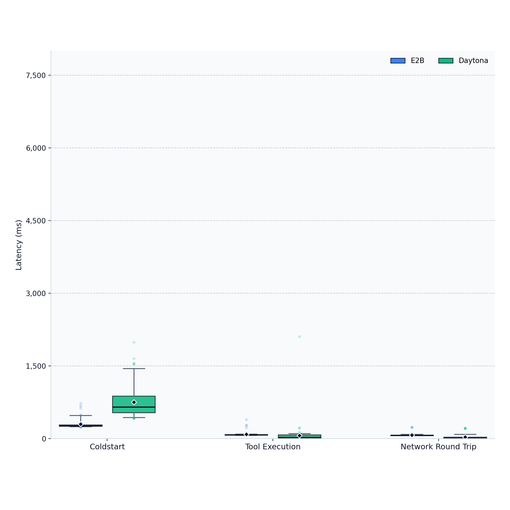
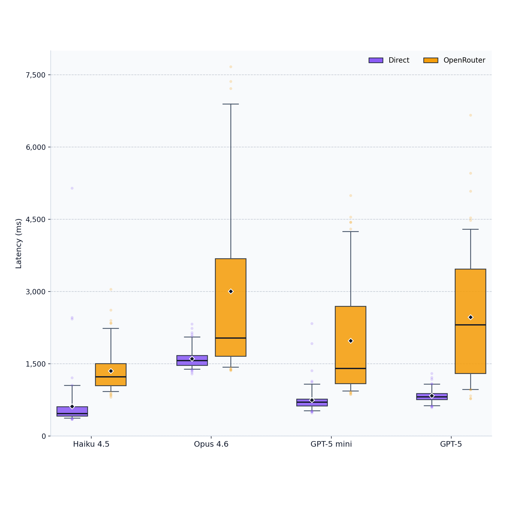

# AI Latency Benchmarks

Round-trip latencies from AWS Lambda to sandbox providers and LLM inference APIs.

## Results





## Methodology

- **Lambda:** Node.js 20.x, 3072 MB, us-east-1 (Ashburn, VA)
- **Samples:** 100 per test (10 fresh sandboxes x 10 samples each)
- **Sandbox tests:** Coldstart = `create()` + `delete()`. Tool execution = `echo ok` via provider SDK. Network round trip = Sandbox Agent `GET /v1/health`.
- **LLM tests:** Minimal prompt (`"Hi"`, max_tokens=1) measuring network + inference overhead, not generation speed.
- **Sandbox provisioning and agent installation are excluded** from exec/health measurements. Sandboxes are reused across samples within each iteration.

### Network topology

| | ASN | Location |
|--|-----|----------|
| Lambda | AS14618 Amazon.com | Ashburn, VA |
| E2B | AS396982 Google LLC | The Dalles, OR |
| Daytona | AS30633 Leaseweb USA | Centreville, VA |

## Usage

```bash
# Run all tests
./invoke.sh /run "tests=*&samples=5"

# CSV output
./invoke.sh /run "tests=llm:*&samples=10&format=csv"

# Full benchmark (10 iterations x 10 samples, outputs sandbox-raw.csv + provider-raw.csv)
./bench.sh

# Network info from Lambda
./invoke.sh /netinfo

# Deploy
./deploy.sh
```
